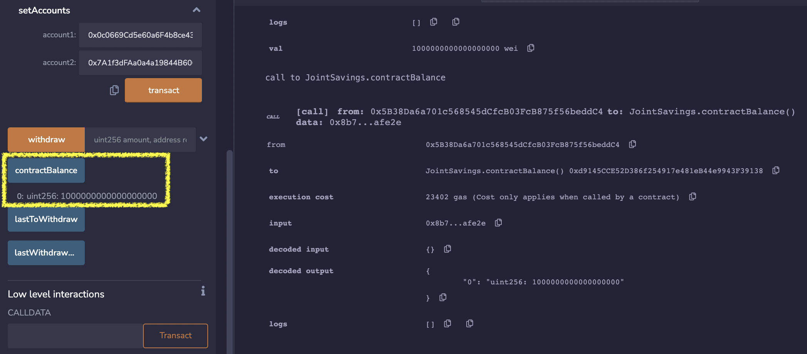
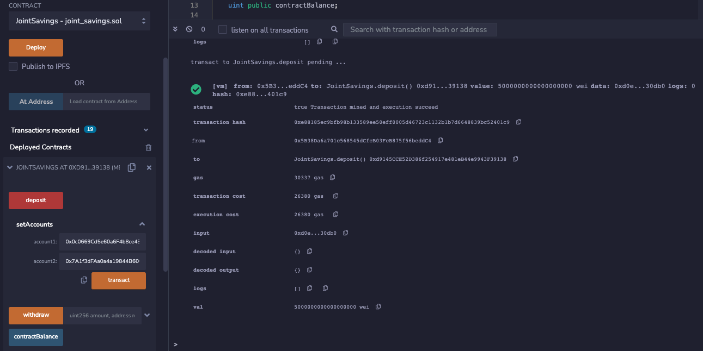
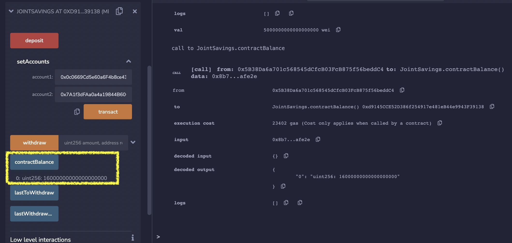
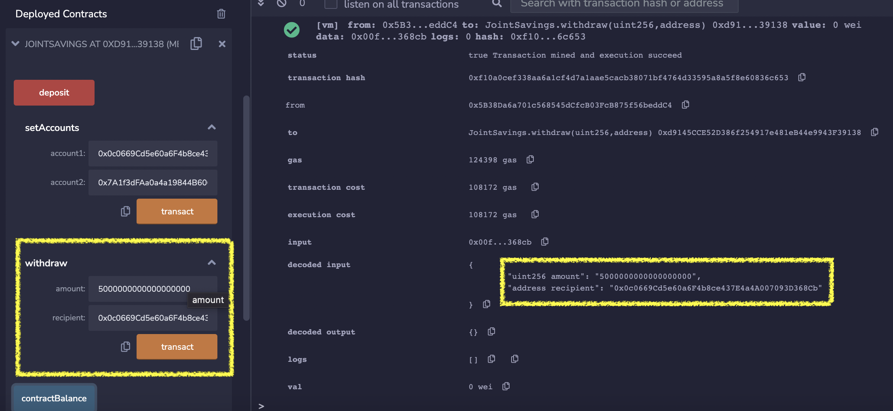
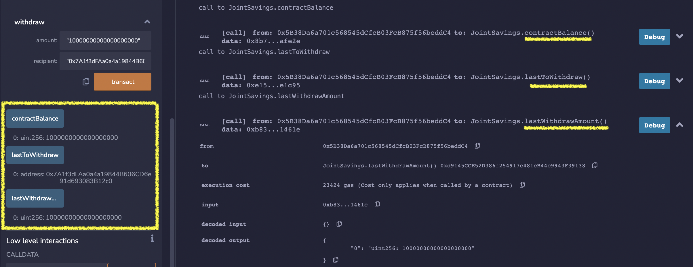

# Smart Contract for Joint Savings Account

In order to automate the creation of joint savings accounts, a Solidity smart contract was created. The smart contract accepts two user addresses that are able to control the joint savings account. Ethereum management functions were written in the smart contract to fulfull a financial institution's requirements of having the necessary features for a joint savings account. For example, the features include being able to deposit and withdraw funds from the account. 

---
## Technologies
This project leverages the following tools:
* [Solidity](https://docs.soliditylang.org/en/v0.8.13/) - programming language for implementing smart contracts
* [Remix IDE](https://remix.ethereum.org/#optimize=false&runs=200&evmVersion=null&version=soljson-v0.8.7+commit.e28d00a7.js) - open source tool that helps you write Solidity contracts straight from the browser; has modules for testing, debugging, and deploying of smart contracts

The Solidity version used for this project was the following:
`pragma solidity ^0.5.0`

---

## Instalation Guide
There are no major installations required. You can access Remix IDE from the web browser. 

---

## Usage
1. Open [Remix IDE](https://remix.ethereum.org/#optimize=false&runs=200&evmVersion=null&version=soljson-v0.8.7+commit.e28d00a7.js) 
2. Open the smart contract file (`joint_savings.sol`) in Remix IDE. (You may need to create a new file and copy and paste the Solidity code to the file)
3. Select the "Solidity Compiler" tab and press the button that says, "Compile joint_savings.sol"
4. Select the "Deploy and Run Transactions" tab and choose the environment of **JavaScript VM**
5. Interact with the functions of the smart contract 

---

## Methods
1. Create and work within a local blockchain development environment using the JavaScript VM provided by the Remix IDE
2. Script and deploy a **JointSavings** smart contract
3. Interact with the deployed smart contract to transfer and withdraw funds

---

## Results 
Here are examples of the Solidity smart contract in action:

### Deployed Contract 


### Using the `setAccounts` function to define the authorized Ethereum addresses that will be able to withdraw funds from the contract
```
Dummy account1 address: 0x0c0669Cd5e60a6F4b8ce437E4a4A007093D368Cb
Dummy account2 address: 0x7A1f3dFAa0a4a19844B606CD6e91d693083B12c0
```


Here is the result of setting up the accounts:


### Testing the `deposit` functionality of the smart contract by sending the following amounts of ether. After each transaction, using the `contractBalance` function to verify that the funds were added to the contract:

#### Transaction 1: Send 1 ether as wei


New Contact Balance:


#### Transaction 2: Send 10 ether as wei


New Contact Balance:


#### Transaction 3: Send 5 ether


New Contact Balance:



### Testing the contract’s `withdrawal` functionality by withdrawing 5 ether into accountOne and 10 ether into accountTwo

Withdrawing 5 ether into `accountOne` - `0x0c0669Cd5e60a6F4b8ce437E4a4A007093D368Cb`:


Last withdrawing account, amount, and contract balance:


Withdrawing 10 ether into `accountTwo` - `0x7A1f3dFAa0a4a19844B606CD6e91d693083B12c0`:


Last withdrawing account, amount, and contract balance:



At the end, the contract balance became 1 ether.

---

## Contributors
Catherine Croft

Email: catherinecroft1014@gmail.com

LinkedIn: [catherine-croft](https://www.linkedin.com/in/catherine-croft-4715481aa/)

---

## License 
MIT